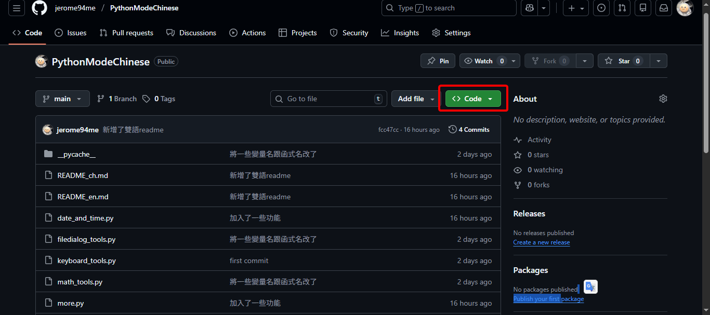
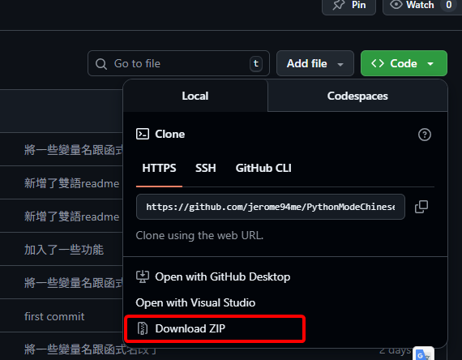

📝 English Translation: How to Download
## 1. First, click the green "Code" button (as shown below)

## 2. Click the "Download ZIP" button


The location where you save it does not matter.

## 3. Unzip the File
You can use [7-zip](https://www.7-zip.org/) to unzip the file, as it is relatively faster.
## 4. Install Dependency Modules
Run install_modes.ps1 to download the required modules.
## 4. Start Using the Module
Place the contents of the newly unzipped folder into your project directory.

You can then freely use the module by importing it like this:
```
import xxx
```
Enjoy using the module!
